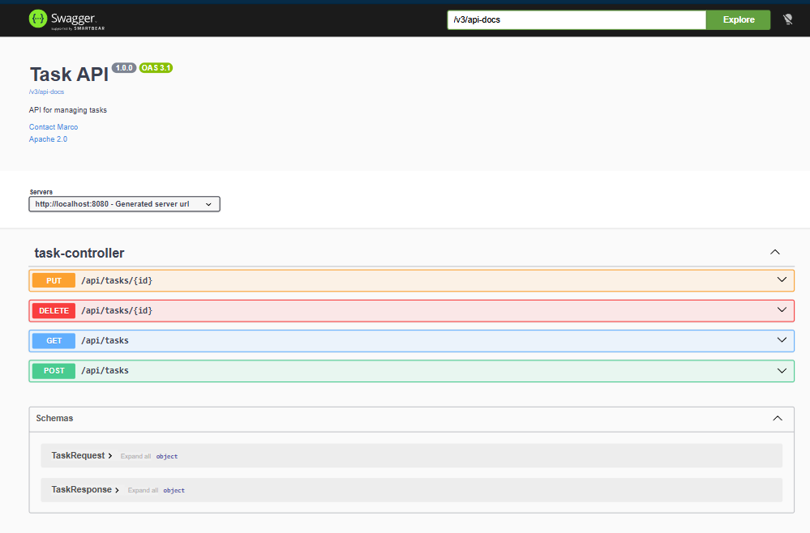

# TASK API
**RESTful** API for managing tasks.  
Provides CRUD operations to create, read, update and delete tasks.  
Built with Spring Boot and Clean Arquitecture principles.  

## Technologies
- Java 17
- Maven
- Spring Boot
- Spring Data JPA
- Spring Doc
- H2 Database
- Lombok

## How to run
1. Clone repository
```git
git clone https://github.com/Marco-Villanueva20/Task-API.git

```
2. Run:
 
```bash
mvn spring-boot:run

```
## Database h2

## H2 Console

- **URL:** [http://localhost:8080/h2-console](http://localhost:8080/h2-console)
- **JDBC URL:** `jdbc:h2:mem:mydb`
- **Username:** `sa`
- **Password:** *(empty)*

## Endpoints

Visibles en la ruta
- **URL:** [http://localhost:8080/swagger-ui/index.html](http://localhost:8080/swagger-ui/index.html)


<!--  -->


 
### Get all tasks
GET /tasks

### Get task by id
GET /tasks/{id}

### Create task
POST /tasks

Body:
{
  "title": "Learn Spring",
  "description": "Study clean architecture"
}

### Update task
PUT /tasks/{id}

### Delete task
DELETE /tasks/{id}


## Architecture

This project follows Clean Architecture:

- domain → business logic
- persistence → database implementation
- controller → REST layer
